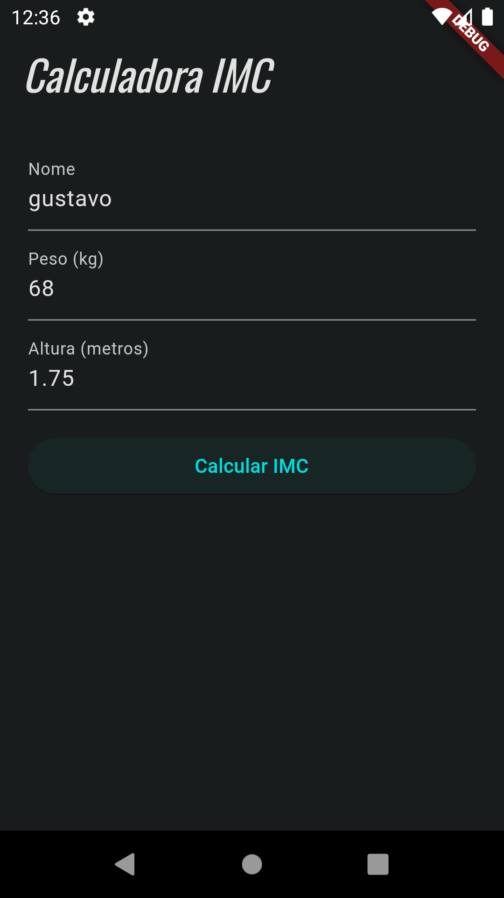
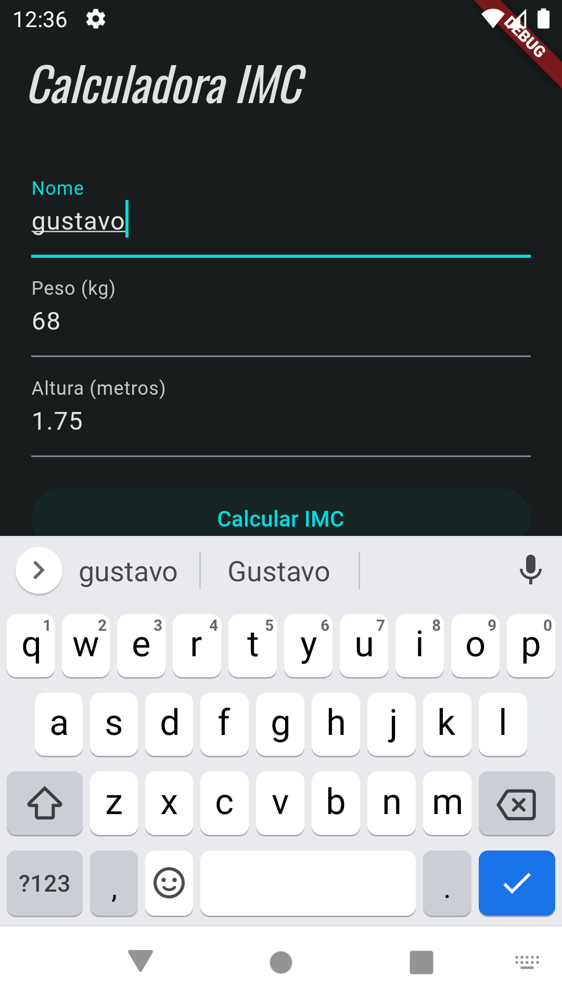

# Calculadora de IMC - Flutter

Este é um aplicativo simples de Calculadora de Índice de Massa Corporal (IMC) desenvolvido em Flutter. O IMC é uma métrica comum para avaliar a relação entre o peso e a altura de uma pessoa, fornecendo uma estimativa do seu estado de peso.

## Funcionalidades

-    Permite que o usuário insira seu nome, peso e altura.
-    Calcula o IMC com base nas informações fornecidas.
-    Exibe o resultado do IMC e o estado de peso correspondente.
-    Interface de usuário simples e fácil de usar.

## Tecnologias Utilizadas

-    Flutter: Um framework de código aberto para criação de aplicativos nativos em múltiplas plataformas.
-    Dart: A linguagem de programação usada pelo Flutter.

## Imagens em funcionamento + Escoço Inicial

  

  

  

  
  ## Esboço Inicial
  
  
